% Introducción a la Inteligencia Artificial Generativa
% Adolfo Sanz De Diego
% Marzo 2026

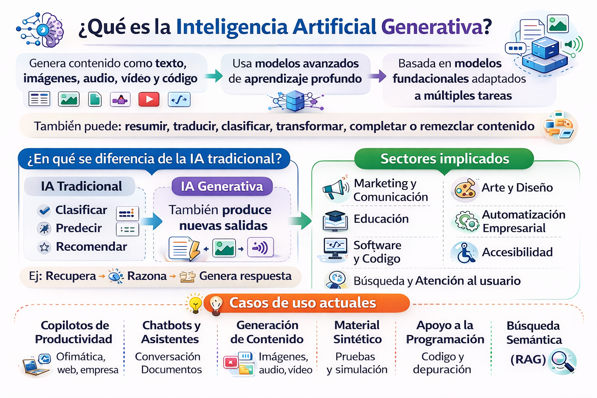

# Introducción

## ¿Qué es la Inteligencia Artificial Generativa?

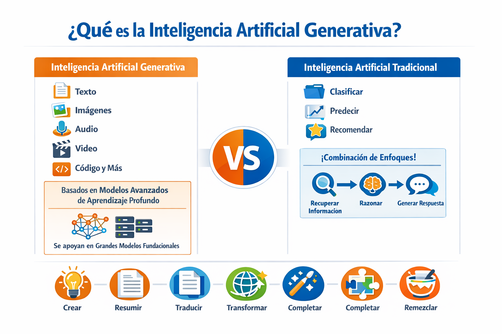

La Inteligencia Artificial Generativa engloba sistemas capaces de **crear texto, imágenes, audio, vídeo, código y otros tipos de contenido** a partir de instrucciones, ejemplos o datos de entrada.

Se basa en **modelos avanzados de aprendizaje profundo** entrenados para identificar patrones, estructuras y relaciones presentes en grandes volúmenes de información.

En la práctica, buena parte de la Inteligencia Artificial Generativa actual se sustenta en **modelos fundacionales**: modelos de gran tamaño y versatilidad que después pueden adaptarse a muchas tareas diferentes.

No se limita a “crear desde cero”: también puede **resumir, traducir, clasificar, transformar, completar o remezclar** contenido ya existente.

La Inteligencia Artificial más tradicional suele orientarse sobre todo a **clasificar, predecir o recomendar**, mientras que la Inteligencia Artificial Generativa añade la capacidad de **producir nuevas salidas** con apariencia original y coherente.

En muchos sistemas modernos ambos enfoques conviven: por ejemplo, un asistente puede **recuperar información**, **razonar sobre ella** y, a continuación, **generar una respuesta**.

## Sectores implicados y casos de uso más actuales

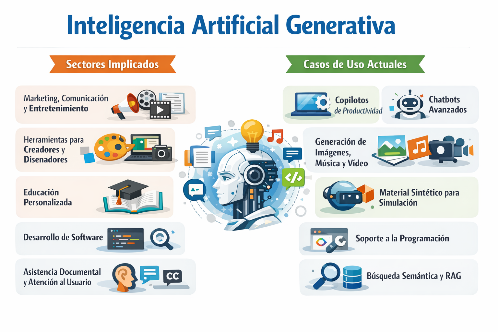

La Inteligencia Artificial Generativa cuenta con aplicaciones prácticas en numerosos sectores, por ejemplo:

- Uso en **marketing, comunicación, entretenimiento y periodismo**.
- Herramientas para **artistas, diseñadores, desarrolladores y creadores audiovisuales**.
- Creación de **material educativo personalizado** y adaptado al nivel del alumnado.
- Uso en **desarrollo de software**, generación de código, documentación técnica y automatización de tareas.
- Asistentes para **búsqueda, análisis documental y atención al usuario**.
- Aplicaciones en **accesibilidad**, por ejemplo subtitulado, lectura en voz alta, simplificación de textos o descripción de imágenes.

Además, cada vez aparecen más casos de uso prácticos, como por ejemplo:

- **Copilotos de productividad** integrados en suites ofimáticas, navegadores, buscadores y herramientas empresariales.
- **Chatbots avanzados** capaces de mantener conversaciones, consultar herramientas y trabajar con documentos.
- Generación de **imágenes, música, locuciones y vídeo** a partir de texto.
- Creación de **material sintético** para pruebas, simulación, entrenamiento y prototipado.
- Sistemas de **apoyo a la programación** que sugieren funciones, detectan errores y explican código.
- Motores de **búsqueda semántica** y asistentes basados en **RAG** (Retrieval-Augmented Generation).

## Beneficios y desafíos

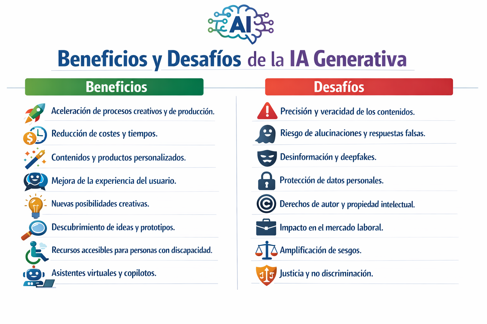

La Inteligencia Artificial Generativa aporta múltiples **beneficios**, entre los que destacan:

- Aceleración de **procesos creativos y de producción**.
- Reducción de **costes y tiempos** en tareas repetitivas o de baja complejidad.
- Creación de **contenidos y productos** altamente personalizados.
- Mejora de la **experiencia del usuario** mediante interfaces conversacionales más naturales.
- Apertura de **nuevas posibilidades creativas**.
- Facilita el **descubrimiento de ideas**, variaciones y prototipos.
- Creación de **recursos accesibles** para personas con **discapacidad**.
- Posibilidad de construir **asistentes virtuales, tutores y copilotos** para multitud de contextos.

La Inteligencia Artificial Generativa también llega acompañada de **desafíos** importantes:

- Dificultad para garantizar la **precisión y veracidad** de los contenidos generados.
- Riesgo de **alucinaciones**, respuestas inventadas o exceso de confianza aparente.
- Riesgos asociados con la **desinformación**, la manipulación y los **deepfakes**.
- Preocupaciones sobre la **protección de datos personales** y la confidencialidad.
- Preocupaciones relacionadas con los **derechos de autor** y la **propiedad intelectual**.
- Posibles efectos en el **mercado laboral** y en las **industrias creativas**.
- Riesgo de **reproducción y amplificación** de sesgos existentes.
- Importancia de la **justicia, explicabilidad y no discriminación** en los sistemas de Inteligencia Artificial.

## Limitaciones y riesgos de seguridad

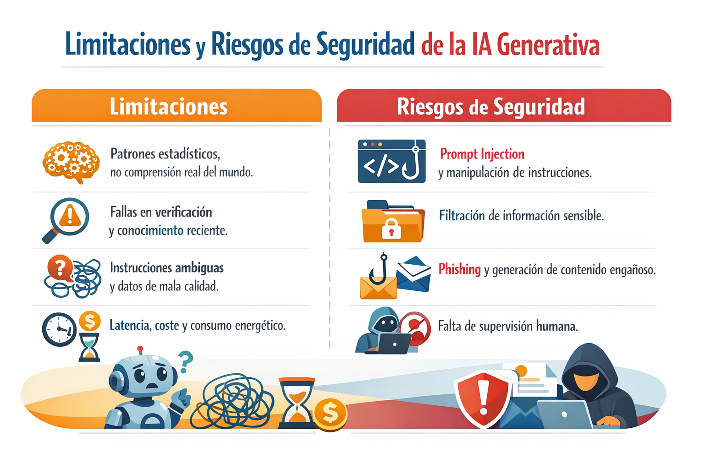

La Inteligencia Artificial Generativa presenta todavía hoy varias **limitaciones**:

- Los modelos no “entienden” el mundo como una persona: operan sobre **patrones estadísticos**.
- Pueden fallar en tareas que requieren **verificación externa**, **conocimiento muy reciente** o **razonamiento complejo** sostenido.
- Son sensibles a **instrucciones ambiguas**, contexto mal estructurado o datos de mala calidad.
- También plantean retos de **latencia, coste, consumo energético y evaluación objetiva**.

La Inteligencia Artificial Generativa también implica **riesgos de seguridad** relevantes:

- **Prompt injection** y manipulación de instrucciones en sistemas conectados a documentos o herramientas.
- Filtración accidental de **información sensible**.
- Automatización de campañas de **phishing**, suplantación o generación masiva de contenido engañoso.
- Dependencia excesiva del modelo sin **supervisión humana**.

## Retos éticos y competencias clave

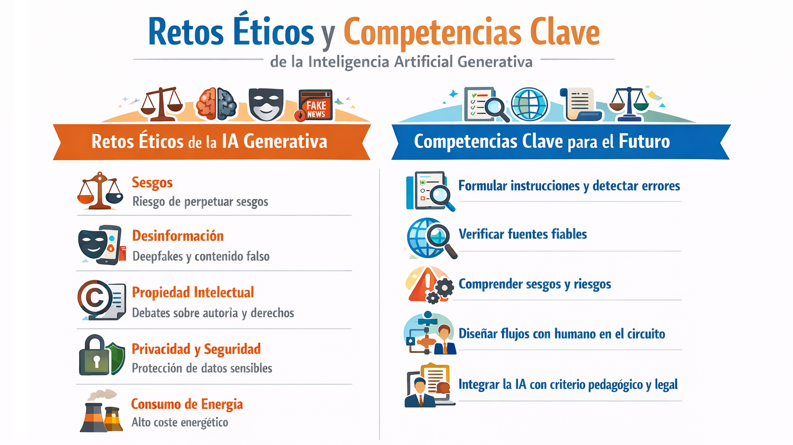

La Inteligencia Artificial Generativa plantea importantes **retos éticos**, tales como:

- **Sesgos:** Los modelos generativos pueden perpetuar o amplificar sesgos presentes en los datos de entrenamiento.
- **Desinformación:** Riesgo de crear contenido falso extremadamente convincente, incluidos **deepfakes**.
- **Propiedad intelectual:** Continúan los debates sobre entrenamiento con obras protegidas y autoría de contenidos generados.
- **Privacidad y seguridad:** Será clave limitar fugas de datos y reforzar los controles de uso.
- **Consumo de energía:** Tanto el entrenamiento como la inferencia requieren recursos computacionales significativos.

De cara al futuro, y también al presente, conviene reforzar las siguientes **competencias clave**:

- Saber **formular instrucciones, revisar resultados y detectar errores**.
- Verificar información con **fuentes fiables**.
- Comprender **límites técnicos, sesgos y riesgos de seguridad**.
- Diseñar flujos de trabajo con **humano en el circuito**.
- Integrar la Inteligencia Artificial Generativa con **criterio pedagógico, ético, legal y organizativo**.

## Tendencias tecnológicas y regulación

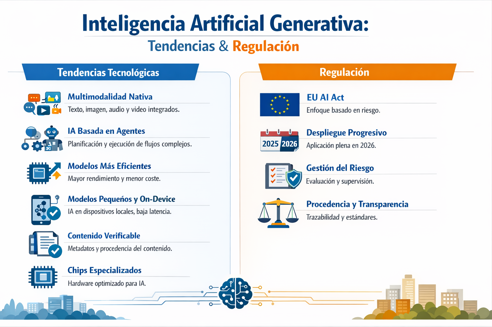

En la evolución de la Inteligencia Artificial Generativa se perfilan varias **tendencias tecnológicas**:

- **Multimodalidad nativa:** Modelos capaces de entender y generar texto, imagen, audio y vídeo de manera integrada.
- **Inteligencia Artificial basada en agentes:** Sistemas con planificación, uso de herramientas y ejecución de flujos complejos.
- **Modelos más eficientes:** Más rendimiento con menos coste mediante cuantización, destilación, MoE y optimización de inferencia.
- **Modelos pequeños y on-device:** Más casos de uso en dispositivos locales, con menor latencia y mejor privacidad.
- **Contenido con procedencia verificable:** Más uso de metadatos y estándares para indicar origen, edición y generación del contenido.
- **Chips especializados:** Desarrollo de hardware específico para entrenamiento e inferencia de Inteligencia Artificial.

La expansión de la Inteligencia Artificial Generativa también ha impulsado su **regulación**:

- La regulación ya forma parte del despliegue real de la Inteligencia Artificial Generativa.
- En la **Unión Europea**, el **EU AI Act** introduce un enfoque basado en riesgo y obligaciones específicas para ciertos sistemas y modelos de propósito general.
- Su calendario de aplicación ya condiciona el despliegue real de muchos productos: algunas obligaciones comenzaron a aplicarse en **2025**.
- El marco general será plenamente aplicable en **2026**.
- Ganan importancia los marcos de **gestión del riesgo**, evaluación, documentación, supervisión humana y auditoría.
- También crece el interés por estándares de **procedencia del contenido**, transparencia y trazabilidad.

# Historia

## Orígenes de la Inteligencia Artificial

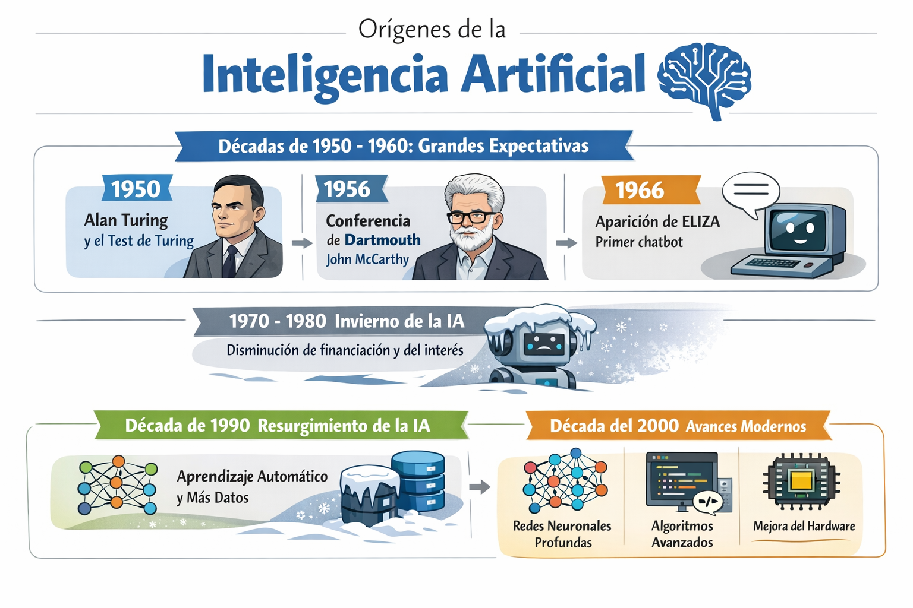

En las décadas de 1950 y 1960 surgieron **grandes expectativas sobre el potencial de la Inteligencia Artificial**, entre las que destacan los siguientes hitos:

- **1950:**
    - **Alan Turing** publica su célebre propuesta sobre máquinas pensantes y el conocido **Test de Turing**.
- **1956:**
    - Se consolida el término **Inteligencia Artificial** en la conferencia de **Dartmouth**, impulsada por **John McCarthy**.
- **1966:**
    - Aparece **ELIZA**, uno de los primeros chatbots conocidos.

Durante las décadas de 1970 y 1980, la Inteligencia Artificial vivió un período conocido como “invierno de la Inteligencia Artificial”, caracterizado por una **disminución significativa de la financiación y del interés público debido a expectativas no cumplidas**.

La década de 1990 marca un resurgimiento de la Inteligencia Artificial gracias a avances en **aprendizaje automático**, al aumento de la capacidad computacional y a una mayor disponibilidad de datos.

En la década de 2000 se produjeron avances en **redes neuronales profundas**, algoritmos complejos y mejora del hardware para entrenamiento.

## Surgimiento de la Inteligencia Artificial Generativa moderna

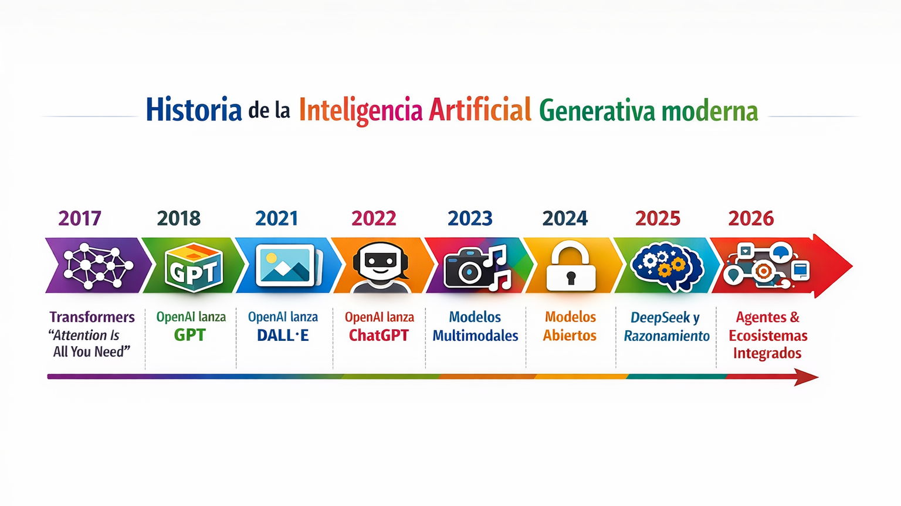

En los últimos años se ha producido una expansión exponencial de la Inteligencia Artificial Generativa:

- **2017:**
    - Se presentan los **transformadores** en el artículo **Attention Is All You Need**.
- **2018:**
    - OpenAI populariza la familia **GPT** (Generative Pre-trained Transformer).
- **2021:**
    - Lanzamiento de **DALL·E**, que impulsa la generación de imágenes a partir de texto.
- **2022:**
    - El lanzamiento de **ChatGPT** de OpenAI impulsa el uso de estos chats entre el gran público.
- **2023:**
    - Se extiende el uso de modelos **multimodales**, capaces de combinar texto, imagen, audio y vídeo.
- **2024:**
    - Se popularizan modelos abiertos y de alto rendimiento como **Llama 3**, aparecen versiones más ligeras para uso local y emergen modelos especializados en **razonamiento**.
- **2025:**
    - El lanzamiento de **DeepSeek**, un modelo chino de pesos abiertos mucho más barato tanto para entrenamiento como para inferencia, revoluciona el mercado.
- **2026:**
    - Avanzan los sistemas basados en **agentes**, el uso de **herramientas externas**, las ventanas de **contexto** más amplias y la integración de los modelos en **productos, procesos y ecosistemas completos**, con foco en seguridad, gobernanza y valor real.

# Modelos Generativos

## Redes Generativas Adversarias (GANs)

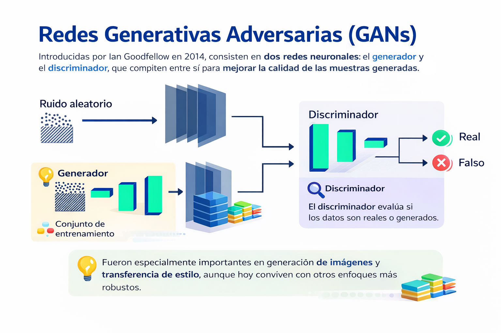

Introducidas por **Ian Goodfellow** en 2014, consisten en **dos redes neuronales**: el generador y el discriminador, que **compiten entre sí para mejorar la calidad de las muestras generadas**.

- El **generador** crea datos falsos que se asemejan a los datos reales.
- El **discriminador** evalúa si los datos son reales o generados.

Fueron especialmente importantes en generación de imágenes y transferencia de estilo, aunque hoy conviven con otros enfoques más robustos.

## Modelos de Difusión

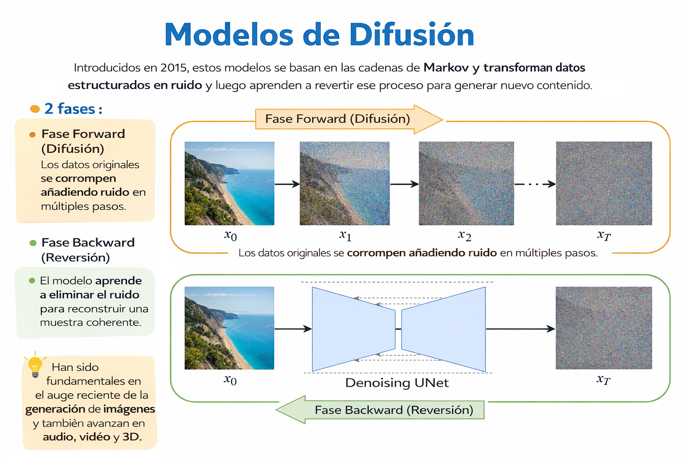

Introducidos en 2015, estos modelos se basan en las cadenas de Markov y **transforman datos estructurados en ruido para después aprender a revertir ese proceso y generar nuevo contenido**. Presentan, por tanto, 2 fases:

- **Fase Forward (Difusión):** Los datos originales se corrompen añadiendo ruido en múltiples pasos.
- **Fase Backward (Reversión):** El modelo aprende a eliminar el ruido para reconstruir una muestra coherente.

Han sido fundamentales en el auge reciente de la **generación de imágenes** y también avanzan en audio, vídeo y 3D.

## Transformers

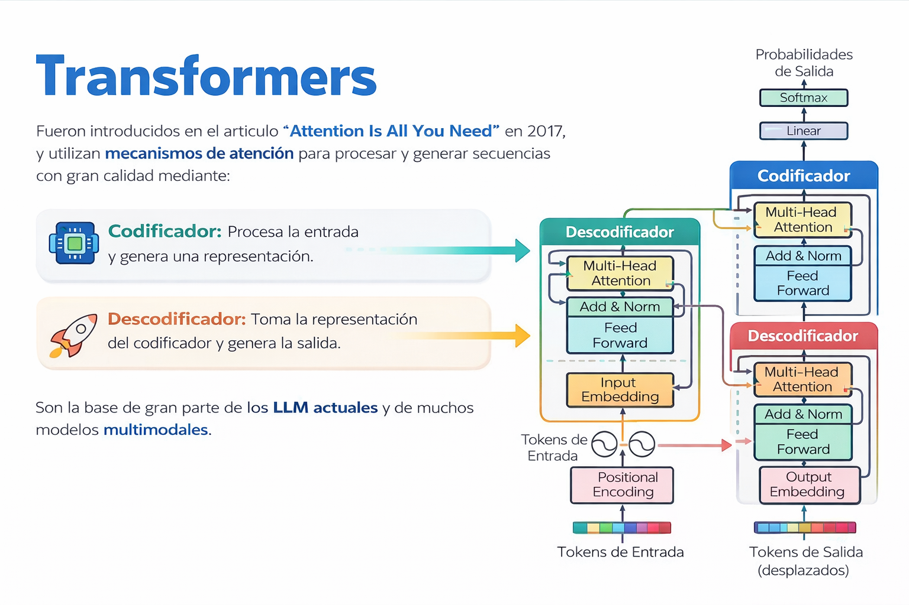

Fueron introducidos en el artículo **Attention Is All You Need** en 2017, y utilizan **mecanismos de atención** para procesar y generar secuencias con gran calidad mediante:

- **Codificador**: Procesa la entrada y genera una representación.
- **Descodificador**: Toma la representación del codificador y genera la salida.

Son la base de gran parte de los **LLM** actuales y de muchos modelos multimodales.

## Modelos autorregresivos

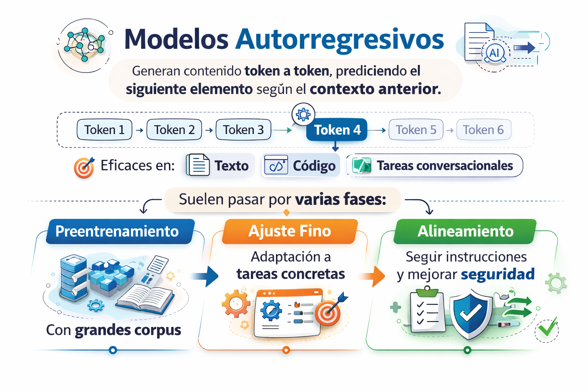

Son modelos que generan contenido **token a token**, prediciendo el siguiente elemento más probable a partir del contexto anterior.

Resultan especialmente eficaces en **texto, código y tareas conversacionales**.

Suelen pasar por varias fases:

- **Preentrenamiento** con grandes corpus.
- **Ajuste fino** o adaptación a tareas concretas.
- **Alineamiento** para seguir instrucciones y mejorar seguridad y utilidad.

## Modelos multimodales

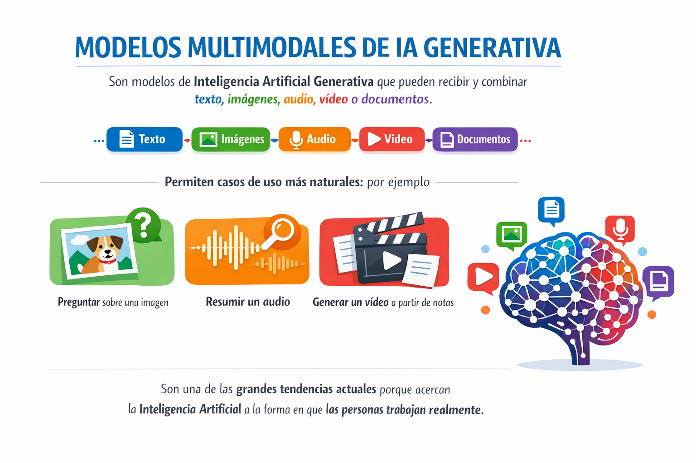

Pueden recibir y combinar **texto, imágenes, audio, vídeo o documentos**.

Permiten casos de uso más naturales: por ejemplo, **preguntar sobre una imagen**, **resumir un audio** o **generar un vídeo a partir de notas**.

Son una de las grandes tendencias actuales porque acercan la Inteligencia Artificial a la forma en que las personas trabajan realmente.

## Modelos Mixture of Experts (MoE)

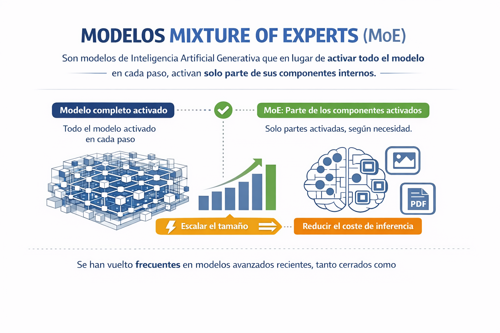

En lugar de activar todo el modelo en cada paso, activan solo **parte de sus componentes internos**.

Esto permite mejorar la **eficiencia computacional** y escalar el tamaño del modelo sin aumentar proporcionalmente el coste de inferencia.

Se han vuelto frecuentes en modelos avanzados recientes, tanto cerrados como abiertos.

# Conceptos clave 

## Tokens

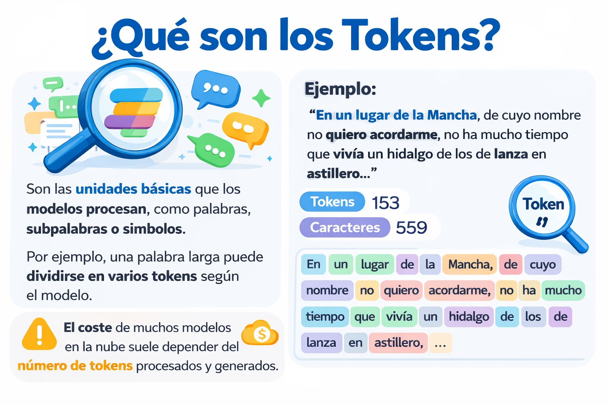

Son las **unidades básicas que los modelos procesan**, como palabras, subpalabras o símbolos. Por ejemplo, una palabra larga puede dividirse en varios tokens según el modelo. El coste de muchos modelos en la nube suele depender del número de **tokens procesados** y generados.

<https://platform.openai.com/tokenizer>

## Embeddings

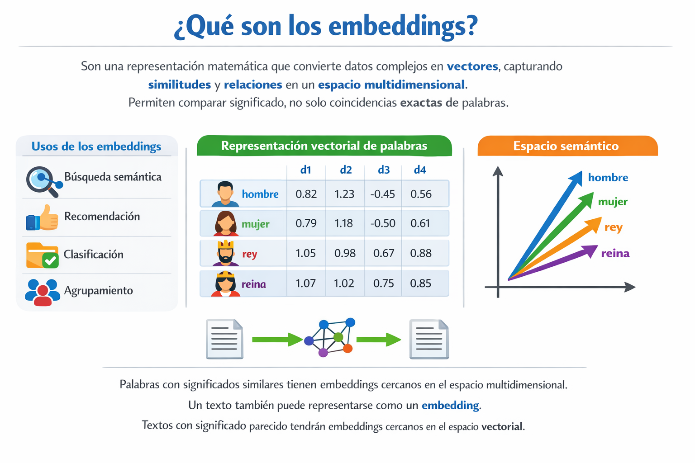

Son una **representación matemática que convierte datos complejos en vectores**, capturando similitudes y relaciones en un espacio multidimensional. Resultan fundamentales para tareas como **búsqueda semántica, recomendación, clasificación y agrupamiento**. Permiten comparar significado, no solo coincidencias exactas de palabras.

Dos palabras con significados parecidos tendrán embeddings situados cerca dentro de su mismo espacio multidimensional. Además, al ser vectores, si sumamos los embeddings de un texto obtenemos otro embedding que representa su significado global, de modo que **la representación en forma de embedding de dos textos similares tenderá a situarse próxima dentro de ese espacio multidimensional**.

## Contexto

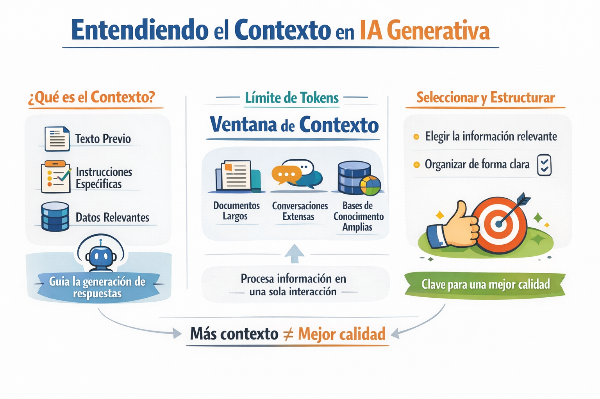

Se refiere a la **información proporcionada como entrada** que guía la generación de respuestas. El contexto incluye el texto previo, las instrucciones específicas y datos relevantes que ayudan al modelo a entender el propósito y mantener la coherencia.

Los modelos tienen un **límite de tokens de contexto** que pueden procesar en una sola interacción, lo que se conoce como **ventana de contexto**. Una ventana mayor permite trabajar mejor con **documentos largos, conversaciones extensas o bases de conocimiento amplias**.

Aun así, disponer de mucho contexto no garantiza por sí solo una mejor calidad: también importa **cómo se selecciona y estructura** la información de entrada.

## Prompt

Es la **instrucción o entrada** que damos al modelo. Un buen prompt suele especificar:

- **Contexto**.
- **Cómo quién debe actuar**.
- **Para qué público hay que dirigir la respuesta**.
- **Tono y estilo de la respuesta**.
- **Acción a realizar**.
- **Formato de salida**.
- **Longitud de la respuesta**.
- **Ejemplos de qué es lo que se quiere**.
- **Restricciones**.

## RAG (Retrieval-Augmented Generation)

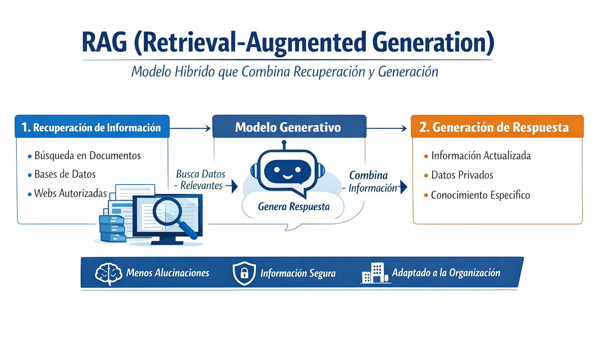

Es una técnica que combina un modelo generativo con un sistema de **recuperación de información**. Antes de responder, el sistema busca fragmentos relevantes en documentos, bases de datos o webs autorizadas. Resulta muy útil para reducir alucinaciones y trabajar con información **actualizada, privada o específica de una organización**.

## Fine-tuning y personalización

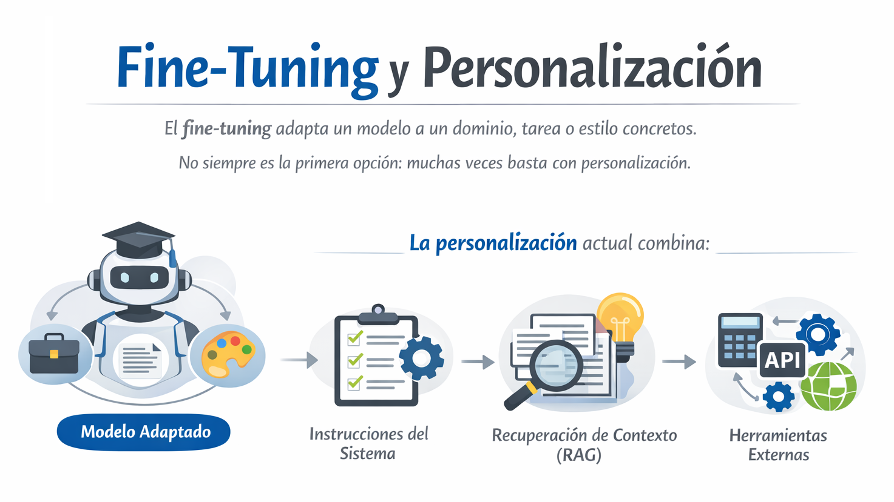

El **fine-tuning** adapta un modelo a un dominio, tarea o estilo concretos. No siempre es la primera opción: en muchos casos basta con personalización.

La personalización actual suele combinar:
- **Instrucciones del sistema**.
- **Recuperación de contexto (RAG)**.
- **Herramientas externas**.

## Uso de herramientas

Los modelos actuales ya no solo generan texto: también pueden **usar herramientas**, como por ejemplo:
- Consultar la web.
- Ejecutar código.
- Buscar en archivos.
- Llamar a APIs.
- Rellenar formularios o automatizar pasos.

Esto amplía mucho su utilidad práctica, pero también introduce retos de **seguridad, permisos y trazabilidad**.

## Agentes

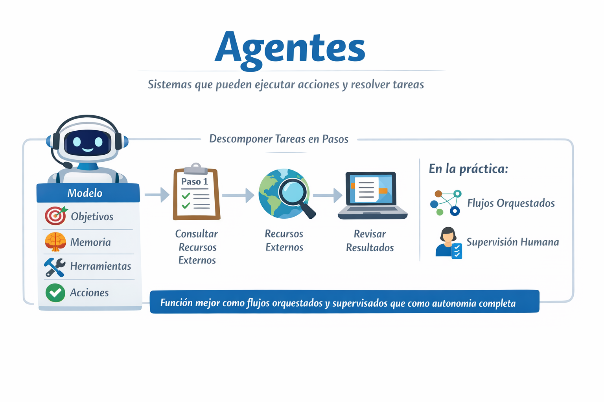

Un agente es un sistema que combina un modelo con **objetivos, memoria, herramientas y capacidad de ejecutar acciones**. Puede descomponer una tarea en pasos, consultar recursos externos y revisar resultados. En la práctica, muchos “agentes” actuales funcionan mejor como **flujos orquestados y supervisados** que como autonomía completa.